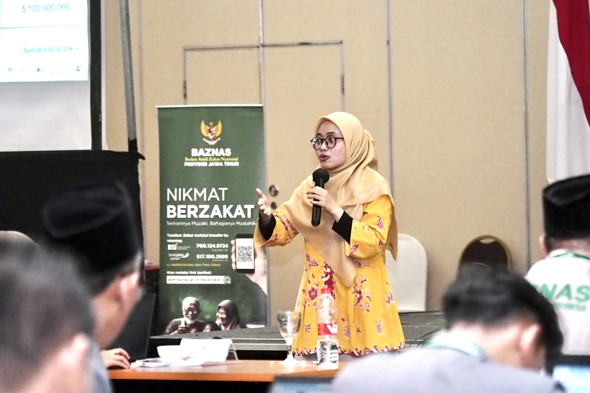
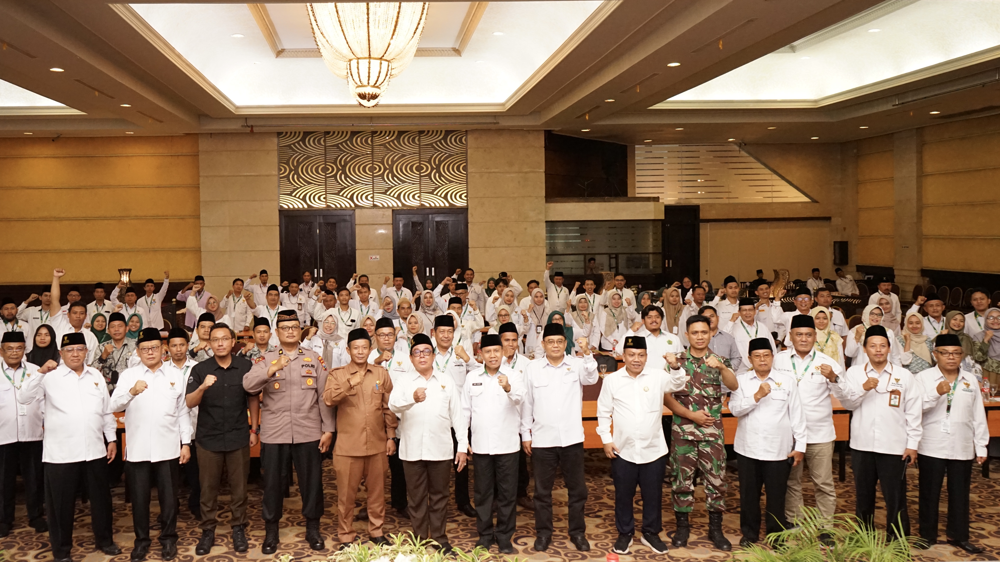

<!DOCTYPE html>
<html lang="id">
<head>
  <meta charset="UTF-8" />
  <meta name="viewport" content="width=device-width, initial-scale=1.0" />
  
  <title>EventName 2025</title>
  <link rel="stylesheet" href="styles.css" />
</head>
<body class="bg-gray-50 text-gray-800">
    
  <!-- HEADER -->
  <header class="bg-gradient-to-r from-green-800 to-lime-400 text-white p-6 flex justify-between items-center shadow-md">
    <h1 class="text-xl font-bold">EventName 2025</h1>
    <button id="menu-toggle" class="text-2xl md:hidden">☰</button>
    <ul id="nav-menu" class="hidden md:flex space-x-6">
      <li><a href="#about" class="bg-yellow-400 text-indigo-700 px-3 py-1 rounded-md"">Tentang</a></li>
      <li><a href="#schedule" class="bg-yellow-400 text-indigo-700 px-3 py-1 rounded-md"">Jadwal</a></li>
      <li><a href="#sponsor" class="bg-yellow-400 text-indigo-700 px-3 py-1 rounded-md"">Sponsor</a></li>
      <li><a href="#register" class="bg-yellow-400 text-indigo-700 px-3 py-1 rounded-md">Daftar</a></li>
    </ul>
  </header>

    <!-- Navigasi -->
    <ul class="nav" id="nav-menu">
      <li><a href="#about">Tentang</a></li>
      <li><a href="#schedule">Jadwal</a></li>
      <li><a href="#sponsor">Sponsor</a></li>
      <li><a href="#daftar">daftar</a></li>

    </ul>
  

</header>

  <!-- HERO -->
<section class="hero h-screen flex flex-col justify-center items-center text-center bg-cover bg-center" style="background-image: url('gambar8.jpg');">
    

      <h1 class="text-4xl font-bold mb-2">Selamat Datang di EventName 2025</h1>
      
Konferensi Inovasi Digital Terbesar Tahun Ini!

      <a href="#register" class="bg-yellow-400 text-indigo-800 px-5 py-2 rounded-lg font-semibold hover:bg-yellow-300 transition">Daftar Sekarang</a>
    

  </section>

  <section id="gallery" class="section alt-bg" >
  

    <h2>Galeri Event</h2>
    

      

        
        
        
        
        
        
        
      

      <button class="prev">&#10094;</button>
      <button class="next">&#10095;</button>
    

  

</section>

  <!-- TENTANG -->
  <section id="about" class="section container">
    <h2>Tentang Event</h2>
    

        Lorem ipsum dolor sit amet, consectetur adipiscing elit. Nulla interdum, dui at venenatis mattis, justo purus imperdiet ex, non lobortis quam lacus a quam. Interdum et malesuada fames ac ante ipsum primis in faucibus. Vestibulum et suscipit massa. Etiam luctus semper sapien, non cursus neque egestas nec. Proin hendrerit efficitur pharetra. Duis efficitur mi eget ligula pretium rutrum at eu metus. Mauris sagittis vel lorem id fringilla. Etiam tempor feugiat tellus, convallis elementum ligula egestas vitae. Duis malesuada nunc non massa bibendum, id porta nibh accumsan. Phasellus id nisi ut augue consectetur tincidunt. Aliquam tempor dignissim sapien, at suscipit arcu commodo in. Ut sollicitudin neque ac dui interdum, sit amet tristique nisi vulputate. In hac habitasse platea dictumst. Vivamus fermentum, libero sed fringilla posuere, elit ante tristique nunc, in dictum lorem nibh id enim. Praesent dignissim ut tellus ut congue. Donec augue lectus, rutrum nec erat nec, fermentum porta ligula. Etiam sed maximus risus. Aenean posuere mi quis egestas volutpat. 
    
 
      
  </section>

<!-- COUNTDOWN -->
  <section id="countdown" class="section container">
    <h2>Waktu Pendaftaran</h2>
    
Pendaftaran ditutup pada <strong>30 Oktober 2025 pukul 23:00 WIB</strong>

    
    

      
00<small>Hari</small>

      
00<small>Jam</small>

      
00<small>Menit</small>

      
00<small>Detik</small>

    

    

  </section>

  <!-- JADWAL -->
  <section id="schedule" class="section alt-bg container">
    <h2>Jadwal Singkat</h2>
    <ul class="timeline">
      <li class="py-12 bg-white text-center"><strong>08:00</strong> - Registrasi Peserta & Welcome Coffee</li>
      <li class="py-12 bg-white text-center"><strong>09:00</strong> - Opening & Keynote Speaker</li>
      <li class="py-12 bg-white text-center"><strong>11:00</strong> - Panel Diskusi & Workshop</li>
      <li class="py-12 bg-white text-center"><strong>13:00</strong> - Lunch & Networking</li>
      <li class="py-12 bg-white text-center"><strong>15:00</strong> - Sesi Inspiratif</li>
      <li class="py-12 bg-white text-center"><strong>17:00</strong> - Penutupan</li>
    </ul>
  </section>

  <!-- SPONSOR -->
  <section id="sponsor" class="section container">
    <h2>Sponsor & Partner</h2>
    

      
      
      
    

  </section>

  <!-- PENDAFTARAN -->
  <section id="register" class="section alt-bg container">
    <h2>Pendaftaran Peserta</h2>
    
    
Pilih kategori yang sesuai dan isi formulir pendaftaran melalui Google Form berikut:

    

      <a href="https://forms.gle/link-form-umum" target="_blank" class="btn-primary">Pendaftaran Peserta Umum</a>
      <a href="https://forms.gle/link-form-vip" target="_blank" class="btn-secondary">Pendaftaran VIP</a>
      <a href="https://forms.gle/link-form-sponsor" target="_blank" class="btn-secondary">Pendaftaran Sponsor</a>
      <a href="https://forms.gle/link-form-ukurankaos" target="_blank" class="btn-secondary">Pemesanan Ukuran Kaos</a>
    

  </section>

  <!-- KONTAK -->
  <section id="contact" class="section container">
    <h2>Kontak Person</h2>
    

      

        <h3>📞 Admin 1</h3>
        
Nama: <strong>Lia</strong>

        
WhatsApp: <a href="https://wa.me/6285854477399" target="_blank">+62 858-5447-7399</a>

      

      

        <h3>📞 Admin 2</h3>
        
Nama: <strong>Nadya</strong>

        
WhatsApp: <a href="https://wa.me/6289676341551" target="_blank">+62 896-7634-1551</a>

      

    

  </section>

  <!-- FOOTER -->
  <footer class="site-footer">
    
© 2025 EventName • All Rights Reserved

  </footer>

  
</body>
</html>
